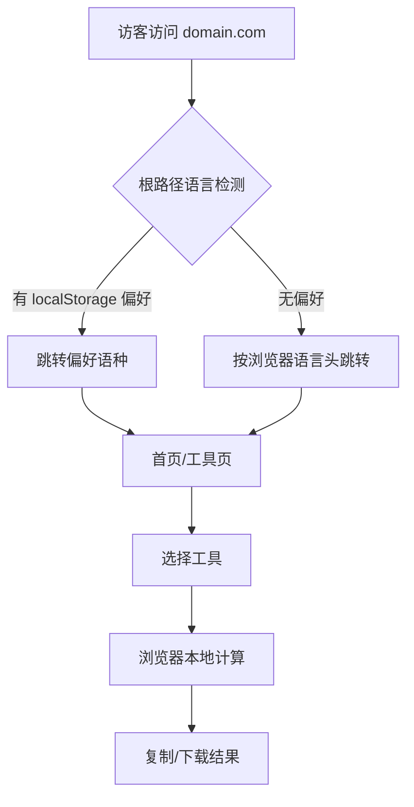

# DevToolHive 产品需求文档（PRD）

## 1. 产品概述
DevToolHive（开发者工具蜂巢）是面向全球前端/后端开发者、独立游戏美术、海外自媒体、跨境从业者的纯前端本地运算多语言开发者工具站。所有功能无后端接口、无数据上传、无用户注册，依托 Google AdSense 合规被动变现，Vercel 免费部署、零服务器运维、零成本长期运营。
- 解决问题：为开发者提供一站式免费、隐私安全（100% 本地浏览器运算）的在线开发与游戏美术工具
- 目标用户：全球开发者、独立游戏美术、自媒体、跨境从业者
- 市场价值：7 语种全球流量覆盖 + 垂直赛道（游戏美术/开发者）高广告 RPM

## 2. 核心功能

### 2.1 用户角色
本站无注册、无用户系统，所有访客为匿名用户，统一权限：浏览并使用全部工具与内容页。

### 2.2 功能模块
1. **首页**：Hero 卖点、工具卡片网格、How it works 介绍
2. **10 个工具页**：见 2.3
3. **内容页**：关于、隐私政策、服务条款（SSG）

### 2.3 页面详情
| 页面名称 | 模块名称 | 功能描述 |
|---|---|---|
| 首页 | Hero 卖点 | 大标题+副标题+四大卖点（本地处理/无上传/永久免费/无需注册） |
| 首页 | 工具卡片网格 | 10 个工具卡片，点击跳转对应工具页 |
| 首页 | How it works | 介绍本地处理流程 |
| JSON-YAML Converter | 工具交互区 | JSON 格式化/压缩、JSON↔YAML 互转、双框 Diff 高亮、导出 CSV、复制/下载、语法错误检测 |
| Pixel Art Palette Generator | 工具交互区 | 取色器、增删排序色块、8bit/16bit 预设、实时预览、导出 PNG/HEX/CSS、一键复制 |
| Meta Tag Generator | 工具交互区 | 表单录入（标题/描述/URL/缩略图）、实时 FB/Twitter 卡片预览、生成 HTML、复制/重置 |
| Case Converter | 工具交互区 | UPPER/lower/Title/camelCase/snake_case/kebab_case/CONSTANT_CASE |
| Timestamp Converter | 工具交互区 | Unix timestamp↔可读日期，秒/毫秒切换，时区 |
| Hash Generator | 工具交互区 | MD5/SHA1/SHA256/SHA512 |
| Color Converter | 工具交互区 | HEX↔RGB↔HSL 互转 + 调色预览 |
| UTM Link Generator | 工具交互区 | 表单生成 utm_source/medium/campaign/term/content |
| Image Compressor | 工具交互区 | Canvas 压缩 PNG/JPEG/WebP，质量调节，本地不上传 |
| Image OCR | 工具交互区 | tesseract.js 本地识别图片文字，多语种 |
| About | 正文 | 项目介绍 |
| Privacy Policy | 正文 | 7 语种隐私政策 |
| Terms of Service | 正文 | 7 语种服务条款 |

## 3. 核心流程
访客进入站点 → 根路径按浏览器语言跳转对应语种 → 浏览首页工具卡片 → 点击进入工具页 → 在浏览器本地完成计算/转换/导出 → 退出。全程无数据上传、无注册。

## 4. 用户界面设计

### 4.1 设计风格
- 主题：浅色简约开发者工具风格
- 主色：浅色底（接近白）+ 蜂巢琥珀/蜂蜜金作为品牌强调色（DevToolHive 蜂巢意象）
- 次色：深灰文字、中性边框
- 字体：等宽字体用于代码/输入区（JetBrains Mono / Fira Code），无衬线字体用于正文标题
- 按钮：圆角、扁平、清晰可点
- 布局：顶部 sticky 导航、桌面左右分栏、移动单列
- 断点：≥1024px 桌面 / <1024px 移动
- 图标：简洁线性图标

### 4.2 页面设计概览
| 页面名称 | 模块名称 | UI 元素 |
|---|---|---|
| 首页 | Hero | 浅色底、大标题、副标题卖点、CTA |
| 首页 | 工具网格 | 卡片网格，桌面右侧广告 C sticky |
| 首页 | 广告 D | 工具卡片中部全宽 |
| 工具页 | 交互区 | 输入框/控件/预览，右侧广告 C |
| 工具页 | 广告 A | 工具区下方全宽 |
| 工具页 | How-To-Use | 教程文本 |
| 工具页 | 广告 B | 底部全宽 |
| 内容页 | 正文+广告 C | 桌面左正文右广告 |

### 4.3 响应式
- 桌面优先（≥1024px 左右分栏 + 侧边广告 C）
- 移动自适应（<1024px 单列，广告 C 直接销毁 DOM 不留空白）
- 全部输入控件移动端占满宽，无横向滚动条

### 4.4 广告位规范（防 CLS）
- A `ads-unit-below-tool`：工具区下方（全端）
- B `ads-unit-page-bottom`：How-To-Use 下 / Footer 上（全端）
- C `ads-unit-sidebar-sticky`：仅桌面≥1024px，移动端销毁 DOM（非 visibility:hidden）
- D `ads-unit-home-middle`：首页工具卡片中部
- 规则：无首屏广告、为空自动折叠、SSR 占位防布局偏移、SSR 水合兼容

### 4.5 合规与 SEO
- 全站 7 语种 hreflang 交替链接，SSR 直出，禁止客户端改 meta
- 每页独立 SEO Title / Description（单页单 SEO）
- `public/ads.txt`（Google 授权）
- GDPR Cookie 弹窗（Consent Mode v2，纯客户端，SSR 不输出 DOM）
- 7 语种隐私政策 + 服务条款全文
