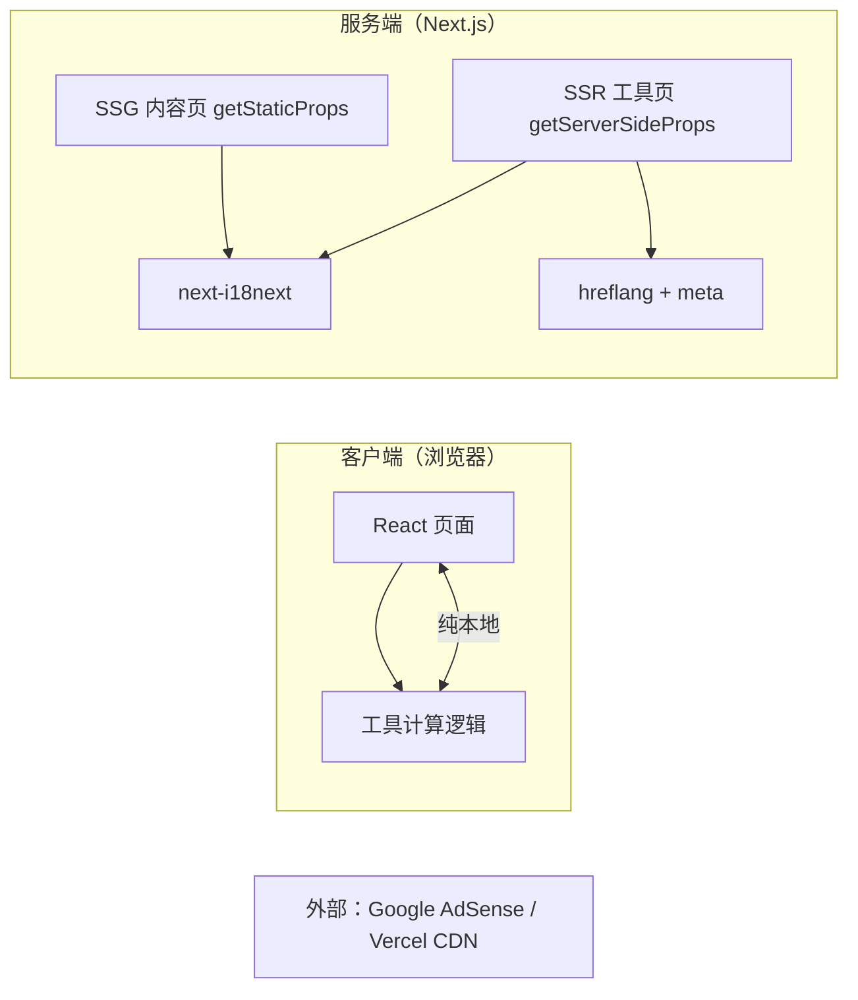

# DevToolHive 技术架构文档

## 1. 架构设计
纯前端架构，无后端、无数据库。所有工具计算在浏览器本地执行；SSR/SSG 仅输出页面骨架与 SEO 内容。



## 2. 技术描述
- 前端：Next.js 14（Pages Router）+ TypeScript + Tailwind CSS
- 初始化工具：create-next-app
- 国际化：next-i18next（7 语种，serverSideTranslations）
- 渲染策略：工具页 `getServerSideProps`（SSR）/ 内容页 `getStaticProps`（SSG）
- 后端：无
- 数据库：无
- 工具计算依赖：
  - JSON-YAML：`js-yaml`、`diff`
  - Hash：Web Crypto API（SHA 系列）+ 纯 JS（MD5）
  - Image Compressor：Canvas API
  - Image OCR：`tesseract.js`（WASM，本地识别）
  - 其余工具：纯 TypeScript
- 部署：Vercel

## 3. 路由定义
| 路由 | 用途 | 渲染 |
|---|---|---|
| / | 首页（英文无前缀，根路径语言检测跳转） | SSG |
| /about | 关于 | SSG |
| /privacy-policy | 隐私政策 | SSG |
| /terms-of-service | 服务条款 | SSG |
| /json-yaml-converter | JSON-YAML 工具 | SSR |
| /pixel-art-palette-generator | 像素调色板 | SSR |
| /meta-tag-generator | Meta 标签生成 | SSR |
| /case-converter | 大小写转换 | SSR |
| /timestamp-converter | 时间戳转换 | SSR |
| /hash-generator | 哈希生成 | SSR |
| /color-converter | 颜色转换 | SSR |
| /utm-link-generator | UTM 生成 | SSR |
| /image-compressor | 图片压缩 | SSR |
| /image-ocr | 图片 OCR | SSR |
| /{lang}/xxx | 多语言子路由（zh-CN/de/fr/it/es/ja） | SSR/SSG |

> 英文主路由无前缀通过 `next.config.js` rewrites 实现：`/xxx` → `/en/xxx`，其余语种走子路由。

## 4. API 定义
无后端 API。所有工具逻辑为纯客户端 TypeScript 函数，定义于 `src/lib/tools/` 下。

## 5. 服务器架构
无后端服务器。Next.js 仅用于 SSR/SSG 渲染，Vercel 托管静态资源与边缘函数。

## 6. 数据模型
### 6.1 i18n 数据结构
无数据库。翻译数据为 `public/locales/{lang}/{namespace}.json` 文件。
- 通用：common、home、about、privacy、terms
- 工具：json-yaml、pixel-palette、meta-tag、case-converter、timestamp、hash-generator、color-converter、utm-link、image-compressor、image-ocr

### 6.2 工具计算模型
各工具为纯函数，输入→输出，无状态持久化。示例：
- `caseConverter(text, mode) → string`
- `timestampConverter(value, direction, unit) → string`
- `hash(text, algorithm) → string`
- `colorConverter(value, from, to) → string`
- `compressImage(file, options) → Blob`
- `ocrImage(file, lang) → string`

## 7. 目录结构
```
devtoolhive/
├── public/
│   ├── ads.txt
│   ├── robots.txt
│   └── locales/{lang}/{namespace}.json
├── src/
│   ├── components/
│   │   ├── layout/ (Header.tsx, Footer.tsx, Layout.tsx)
│   │   ├── ads/ (AdUnit.tsx, AdScript.tsx)
│   │   ├── CookieConsent.tsx
│   │   ├── LanguageSwitcher.tsx
│   │   ├── ToolCard.tsx
│   │   └── Seo.tsx
│   ├── hooks/useMediaQuery.ts
│   ├── lib/tools/ (10 个工具纯客户端逻辑)
│   ├── pages/
│   │   ├── _app.tsx
│   │   ├── _document.tsx
│   │   ├── index.tsx (SSG)
│   │   ├── about.tsx / privacy-policy.tsx / terms-of-service.tsx (SSG)
│   │   └── [lang]/ (10 个工具 SSR)
│   └── styles/globals.css
├── next-i18next.config.js
├── next.config.js (rewrites)
├── tsconfig.json
└── package.json
```

## 8. 各页 SEO 文案（英文主，其余语种翻译）
| 页面 | Title | Description |
|---|---|---|
| 首页 | Free Online Developer & Game-Dev Tools \| 100% Local Browser Processing | Free online developer and game-dev tools. JSON YAML converter, pixel art palette generator, meta tag generator. 100% local processing, no upload, no signup. |
| JSON-YAML Converter | JSON to YAML Converter & JSON Formatter Online Free | Convert JSON to YAML and YAML to JSON. Format, minify, and diff JSON. Free, local browser processing. |
| Pixel Art Palette | Pixel Art Palette Generator - 8-bit & 16-bit Color Tool | Create pixel art palettes with 8-bit/16-bit presets. Export PNG, HEX, CSS. Free for indie game artists. |
| Meta Tag Generator | Meta Tag & Open Graph Generator - Free SEO Tool | Generate SEO meta, Open Graph and Twitter Card tags with live social preview. Free online. |
| Case Converter | Case Converter Online - Upper, Lower, Title, Camel | Convert text to uppercase, lowercase, title, camelCase, snake_case, kebab-case. Free. |
| Timestamp Converter | Unix Timestamp Converter - UTC Date Time Online | Convert Unix timestamp to date and back. Seconds/milliseconds, timezone. Free local tool. |
| Hash Generator | Hash Generator Online - MD5, SHA1, SHA256, SHA512 | Generate MD5, SHA1, SHA256, SHA512 hashes from text. Free, local browser. |
| Color Converter | Color Converter - HEX, RGB, HSL Format Tool | Convert colors between HEX, RGB, HSL. Free online color converter. |
| UTM Link Generator | UTM Link Builder - Free UTM URL Generator | Build UTM tracking URLs with source/medium/campaign/term/content. Free. |
| Image Compressor | Image Compressor Online - PNG, JPEG, WebP Free | Compress images to reduce size. PNG/JPEG/WebP. 100% local, no upload. |
| Image OCR | Image to Text OCR Online - Extract Text Free | Extract text from images via OCR, runs locally. Free online image to text tool. |
| About | About DevToolHive - Free Local Developer Tools | About DevToolHive, free developer and game-dev tools running 100% in your browser. |
| Privacy Policy | Privacy Policy - DevToolHive | All tools process data locally. No upload, no registration. Read our privacy policy. |
| Terms of Service | Terms of Service - DevToolHive | Terms of service for using DevToolHive's free online developer tools. |
